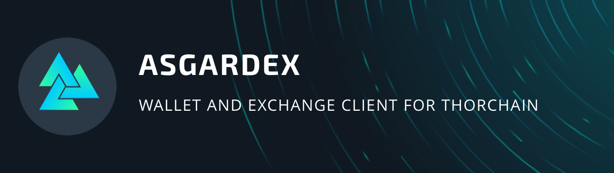
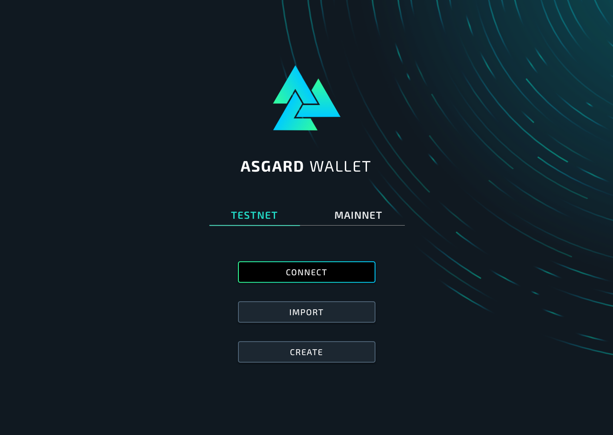

<div align="center">
  
  <br/>
  <br/>
  
</div>

# ASGARDEX(feeless)

This is a fork of [the original repository for ASGARDEX](https://github.com/asgardex/asgardex-desktop) free of any affiliate fees or tracking with minimal changes to the original code.

## How to build the application yourself (recommended, non-technical & beginner friendly)

1. Install the [git version control system](https://git-scm.com/downloads) for your operating system
   - [Windows](https://git-scm.com/download/win)
   - [Linux](https://git-scm.com/download/linux)
   - [Mac](https://git-scm.com/download/mac)
2. Install [NodeJS v16.15.0](https://nodejs.org/download/release/v16.15.0/) for your operating system.
   - Windows: [Download](https://nodejs.org/download/release/v16.15.0/node-v16.15.0-x64.msi) (Windows users must also install the optional [Chocolatey](https://chocolatey.org/install) package manager that is prompted after NodeJS is installed)
   - Linux: It is recommended to install NodeJS with your distribution specific package manager, alternatively you can find the binary [Download](https://nodejs.org/download/release/v16.15.0/) or try the following using any default command line terminal: `curl -o- https://raw.githubusercontent.com/nvm-sh/nvm/v0.39.1/install.sh | bash && nvm install 16.15.0 && nvm use 16.15.0`
   - Mac: `brew install node@16.15.0`
3. Open a command line terminal for your operating system
   - Windows: Users should use PowerShell (found by searching 'PowerShell' from the Windows Start menu)
   - Linux/Mac: Users should use any default command line terminal
4. Download the source code of this projects repository by entering `git clone https://github.com/0xNegnin/asgardex-desktop-feeless` on your command line terminal you just opened
5. Navigate to the directory you just downloaded by entering `cd asgardex-desktop-feeless` as it should be in the same directory if you haven't navigated away
6. (Optional) Inspect the code and make sure there are only relevant changes (removed affiliate fees & tracking) if you are able to, or delegate this task to someone you trust who is able to
7. Set the environment variable `NODE_OPTIONS="--max-old-space-size=8192"` on your operating system
   - Windows: On PowerShell users should type `$env:NODE_OPTIONS="--max-old-space-size=8192"`
   - Linux/Mac: On any default command line terminal users should type `export NODE_OPTIONS="--max-old-space-size=8192"`
8. Compile the program
   - Windows: On PowerShell navigate to the `.\asgardex-desktop-feeless\` directory, type `yarn` then `yarn package` after it completes. If an error is propmted and the command `yarn` is not found, type `npm install -g yarn` then retry
   - Linux/Mac: On any default terminal navigate to the `./asgardex-desktop-feeless/` directory, then type `yarn && yarn package`. If an error is prompted and the command `yarn` is not found, type `npm install -g yarn` then retry
9. If successfully built, the application will be under the `./asgardex-desktop-feeless/release/` directory which you can then use

## Send me coffee (optional)

If you think it's neat that I keep the ASGARDEX wallet free to use for your average Joe, feel free to send me something (or don't, donations should be a choice)

```
RUNE: thor107uevlvk2wq06k92muptr2y779747a0ppmxauw
BTC: bc1q7l285qpgfnsy4nvagt3x8cv8q64ju8slz5jpat
BCH: qzxlfe6d3h2zpxzxkg2y4ax3vgexzg7kfg5unzr3qc
ETH/AVAX/BSC: 0xbf6c604c6ae481d6319513789870196f988052f2
BNB Beacon: bnb176yz9wrh2anzzavhsunefa20tq0ffqymj5yf83
LTC: ltc1qa7huxr86p9nxe40tjn0h95eljadczxw3vrnhy0
ATOM: cosmos1kcjrxrqn3hjhnc2t0pudfvjf5pd0l75v292emg
```
